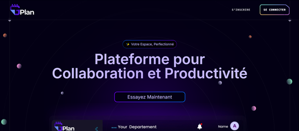
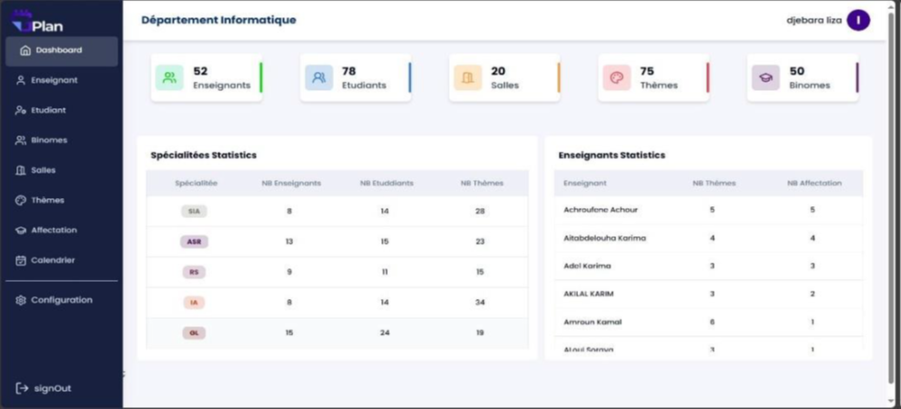
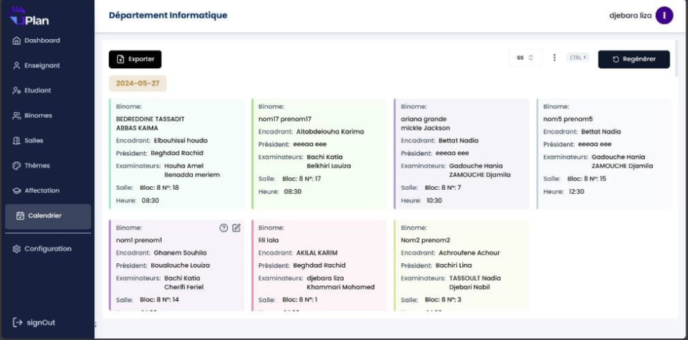

# 📅 Application de Gestion des Soutenances – Module Administrateur

Ce projet est une application web développée avec **Next.js**, destinée à la **gestion et la planification des soutenances** au sein d’un établissement universitaire.  
Ce module représente **l’espace Administrateur** et permet la configuration, l’organisation et le suivi du processus de soutenance.

> 🧑‍🏫 Les interfaces *Enseignant* et *Étudiant* sont dans un projet séparé.

---

## 🚀 Technologies Utilisées

| Technologie | Rôle |
|------------|------|
| **Next.js** | Framework React utilisé pour le frontend |
| **Tailwind CSS** | Mise en forme et interface utilisateur moderne |
| **Node.js** | Environnement d’exécution JavaScript |
| **MySQL** | Gestion de la base de données |
| **Axios / Fetch** | Communication Client ↔️ Serveur |

---

## 🔐 Rôles Gérés dans ce Module

| Rôle | Description |
|------|-------------|
| **Administrateur** | Gère les utilisateurs, les salles, les soutenances et génère le planning |

---

## 🎯 Fonctionnalités Principales (Module Administrateur)

### 👤 Gestion des Utilisateurs (Enseignants & Étudiants)
- Création, modification, désactivation et suppression des comptes.
- Attribution des rôles et permissions.
- Interface Administrateur dédiée.

---

### 🗓️ Configuration Initiale
- Définir la **période de soutenance**.
- Paramétrer les **créneaux horaires**.
- Ajouter et gérer :
  - Les **enseignants**
  - Les **étudiants**
  - Les **salles**

---

### 📝 Gestion & Affectation des Thèmes
- Ajouter / modifier / supprimer des **thèmes de PFE** proposés par les enseignants.
- Visualiser les thèmes disponibles selon **spécialité**.
- Sélection et validation des thèmes pour les **binômes**.
- Affectation des thèmes par les enseignants ou l’administration.

---

### ⚙️ Génération Automatique du Planning
- Génération automatique des **jurys** selon :
  - Grade
  - Domaine
- Affectation automatique :
  - Salle
  - Heure
  - Jury
- Génération automatique d’un planning **optimisé** en fonction des **disponibilités**.

---

### 🗃️ Gestion du Planning
- Ajustement manuel du planning généré.
- Consultation du planning :
  - Global
  - Pour chaque enseignant (jury ou encadrant)
  - Pour chaque étudiant
- **Export / Téléchargement** du planning (PDF ou image selon votre implémentation).

---

## 📦 Installation & Exécution

### 1️⃣ Cloner le projet
```bash
git clone https://github.com/ton-pseudo/nom-du-projet.git
cd nom-du-projet
```

### 2️⃣ Installer les dépendances
```bash
npm install
```

### 3️⃣ Lancer l'application en mode développement
```bash
npm run dev
```
Ensuite, ouvrir :
👉 http://localhost:3000

## 🖥️ Interface Dashboard

<p align="center">
  
</p>

---

## 📈 Statistics

<p align="center">
  
</p>

## ⏲ Planning

<p align="center">
  
</p>

## 🌍 Live Demo

🔗 https://planning-soutenance.vercel.app/
